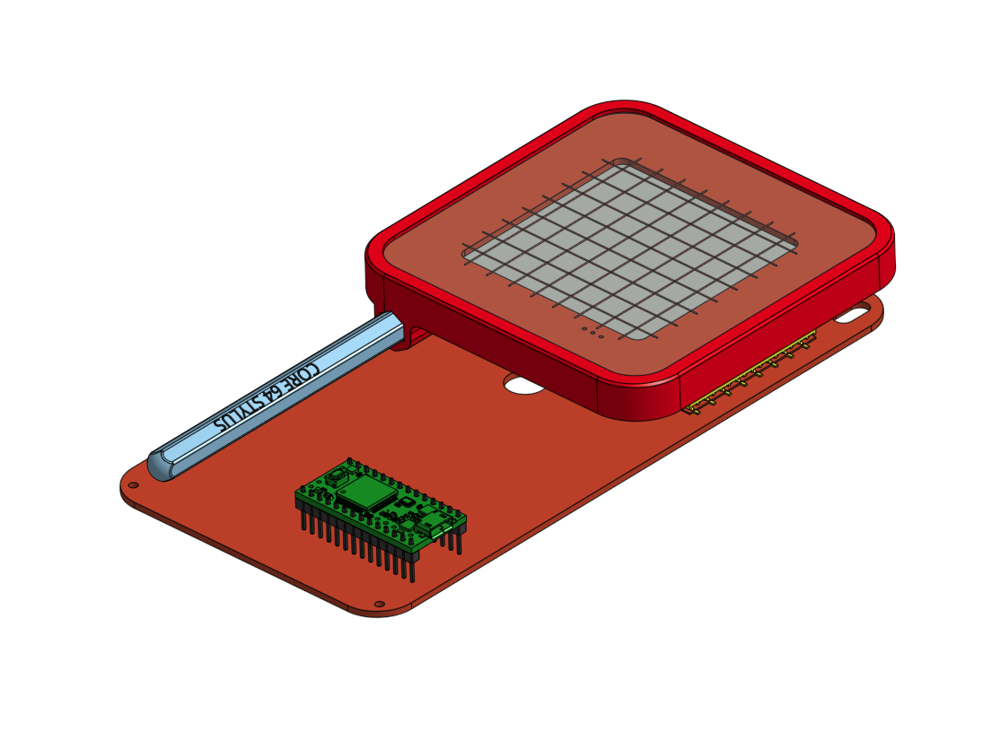

# Core-64-Interactive-Core-Memory-Badge
64 bits of core memory and LEDs to interact with directly using a magnetic wand.

Follow this project at: https://hackaday.io/project/166155-core-64-interactive-core-memory-badge

# Hardware Version History
v0.1 Single Green Board. The first hand assembled prototype. Made one.

v0.2 Bug fixes learned from v0.1 applied. This version has not been made or tested, but should work.

v0.3 Prototype assembly in progress: Red Dual Boards, one for the core array, one for everything else.

