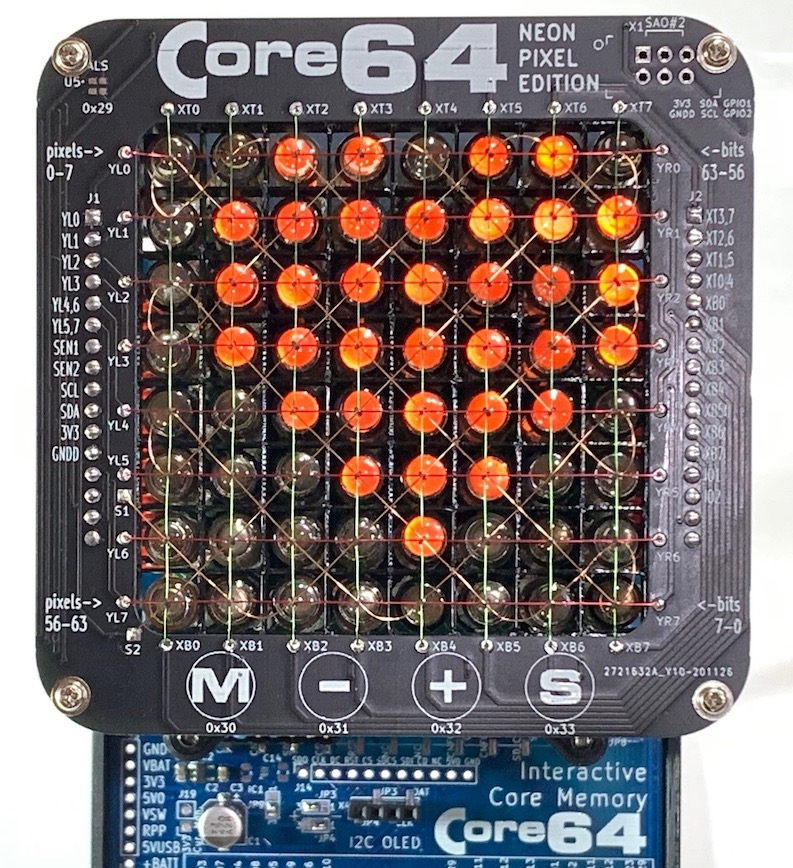

# Core-64-Interactive-Core-Memory-Badge
Weave your own 64 bits of core memory over the top of LEDs to interact with directly using a magnetic wand.

Purchase: https://www.Core64.io

Follow this project at: https://hackaday.io/project/166155-core-64-interactive-core-memory-badge

You are in the development repository. Beta Kits and production version firmware is at https://github.com/ageppert/Core64/

# Hardware Version History (latest on top)

v0.5 Triple Board (added custom LED Matrix) - Beta Test Kits. Beta Kit Repo at https://github.com/ageppert/Core64/

v0.4 Core Board - Neon Pixel Edition. Expanded Core Grid Array to work with [Neon Pixels](https://pierremuth.wordpress.com/2020/07/08/neon-pixel/)!

v0.4 Dual Boards (Blue LB + Yellow CB), moved up to Teensy 3.2, removed IO Expanders, added more expansion/hacking headers.

v0.3.1 Hand re-worked v0.3 with 5V0 and 3V3 regulators each seperately sourced after power switch to provide improved power supplies.

v0.3 Dual Boards (both Red) with Teensy LC. One core board, one logic board. Used IO Expanders to drive the Core matrix, which ended up being way too slow.

v0.2 Bug fixes learned from v0.1 applied. This version has not been made or tested, but should work.

v0.1.1 Single Green Board worked after I added missing OR gate circuitry!

v0.1 Single Green Board with Teensy LC. The first hand assembled prototype. Made one and it worked after I added missing circuitry!

Share-A-Hack version

Proof-Of-Concept version
